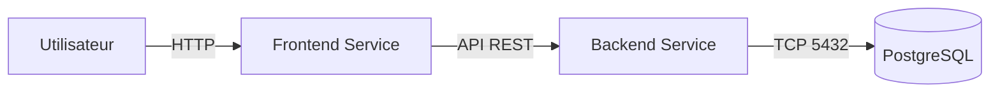

# 📝 Todo List

Bienvenue dans la documentation complète du projet **Todo List**. Cette application est une solution 'fullstack' déployée sur Kubernetes.
---

## Architecture

Le projet repose sur une architecture micro-services orchestrée par **Kubernetes**.

### Composants Principaux

1. **Frontend (React/Vite)** :
   - Interface utilisateur moderne et responsive.
   - Communique avec l'API Backend via HTTP.
   - Service Kubernetes de type `LoadBalancer` pour l'accès externe.

2. **Backend (Node.js/Express)** :
   - API RESTful gérant la logique métier.
   - Connecte le Frontend à la base de données PostgreSQL.
   - Gère la persistance des données et la logique de reconnexion (Retry Logic).

3. **Base de Données (PostgreSQL)** :
   - Stockage persistant des tâches.
   - Déployé en tant que StatefulSet/Deployment avec un Volume Persistant (PVC).

### Schéma de Communication


---

## Guide d'Installation

### 1. Pré-requis

Avant de commencer, assurez-vous d'avoir installé les outils suivants sur votre machine :

- **Git** : Pour cloner le projet.
- **Docker** : Pour la conteneurisation.
- **Minikube** : Pour exécuter un cluster Kubernetes local.
- **Kubectl** : L'outil en ligne de commande Kubernetes.

### 2. Cloner le Projet

Ouvrez votre terminal et exécutez :

```bash
git clone https://github.com/ismahamat/todo-list.git
cd todo-list
```

### 3. Installation des Dépendances

Après avoir cloné le projet, installez les dépendances pour le backend et le frontend :

```bash
# Installation des dépendances du backend
cd backend
npm install

# Installation des dépendances du frontend
cd ../frontend
npm install

# Retour à la racine du projet
cd ..
```
---

## Déploiement sur Kubernetes (Minikube)

### 1. Lancer l'Application

Nous avons simplifié le déploiement avec un script automatisé.

**Pour lancer l'application (Build & Deploy) :**

```bash
./start.sh
```

> **Ce que fait ce script :**
> - Vérifie si Minikube est lancé.
> - Construit les images Docker locales directement dans Minikube.
> - Applique tous les fichiers de configuration Kubernetes (`k8s/`).
> - Attend que tous les pods soient prêts.
> - Affiche l'URL d'accès.

### 4. Accéder à l'Application

Une fois le script terminé, il vous indiquera une URL.
Si vous êtes sur macOS, vous devrez probablement garder un terminal ouvert avec la commande suivante pour maintenir le tunnel actif (si le script ne le fait pas pour vous) ou utiliser l'URL `minikube service` fournie :

```bash
minikube tunnel
```

---

## 📂 Structure du Projet

Voici un aperçu détaillé du contenu du dépôt.

| Dossier/Fichier | Description |
|-----------------|-------------|
| **`backend/`** | Code source de l'API Node.js. |
| `backend/app.js` | Point d'entrée, configuration serveur et connexion DB. |
| `backend/Dockerfile` | Configuration pour construire l'image Docker du backend. |
| **`frontend/`** | Code source de l'application React. |
| `frontend/src/` | Composants React et styles CSS. |
| `frontend/Dockerfile` | Configuration pour construire l'image Docker du frontend. |
| **`k8s/`** | Manifestes Kubernetes. |
| `k8s/backend.yaml` | Déploiement et Service pour l'API. |
| `k8s/frontend.yaml` | Déploiement et Service pour l'UI. |
| `k8s/postgres.yaml` | Déploiement, Service, PVC et Secret pour la DB. |
| `start.sh` | Script d'automatisation du déploiement. |
| `stop.sh` | Script de nettoyage des ressources. |

---

## Commandes Utiles

Pour une personne administrant le projet, voici quelques commandes essentielles :

**Voir l'état des pods :**
```bash
kubectl get pods
```

**Voir les logs du backend (pour débogage) :**
```bash
kubectl logs -l app=backend
```

**Obtenir l'URL d'accès (si perdue) :**
```bash
minikube service frontend --url
```

**Arrêter et nettoyer le projet :**
```bash
./stop.sh
```

---

## Configuration (YAML)

Les fichiers dans `k8s/` définissent l'infrastructure :

- **`frontend.yaml`** : Expose le port 80 via un LoadBalancer.
- **`backend.yaml`** : Expose le port 8080 en ClusterIP (interne uniquement).
- **`postgres.yaml`** : Configure le stockage persistant et les identifiants de base de données.

---

## Pourquoi Minikube ?

Dans le cadre de ce projet scolaire, nous avons choisi **Minikube** plutôt qu'un cluster Kubernetes cloud (GKE, EKS, AKS...) pour plusieurs raisons :

- **Gratuit** : Minikube fonctionne entièrement en local, sans frais de cloud computing.
- **Simplicité** : Installation rapide et aucune configuration de compte cloud ou de facturation nécessaire.
- **Apprentissage** : Permet de comprendre les concepts Kubernetes (Pods, Services, Deployments, PVC) dans un environnement contrôlé.
- **Portabilité** : Chaque développeur peut reproduire l'environnement sur sa propre machine.

---

## Crédits

Projet réalisé par :

- **Issa MAHAMAT**
- **Paul BERLEMONT**
- **Florian BOZEL**
- **Keveen BOUENDJA**
- **Timothy OUPINDRIN**
